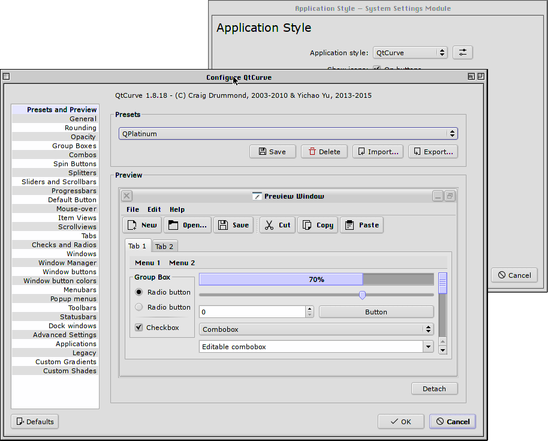
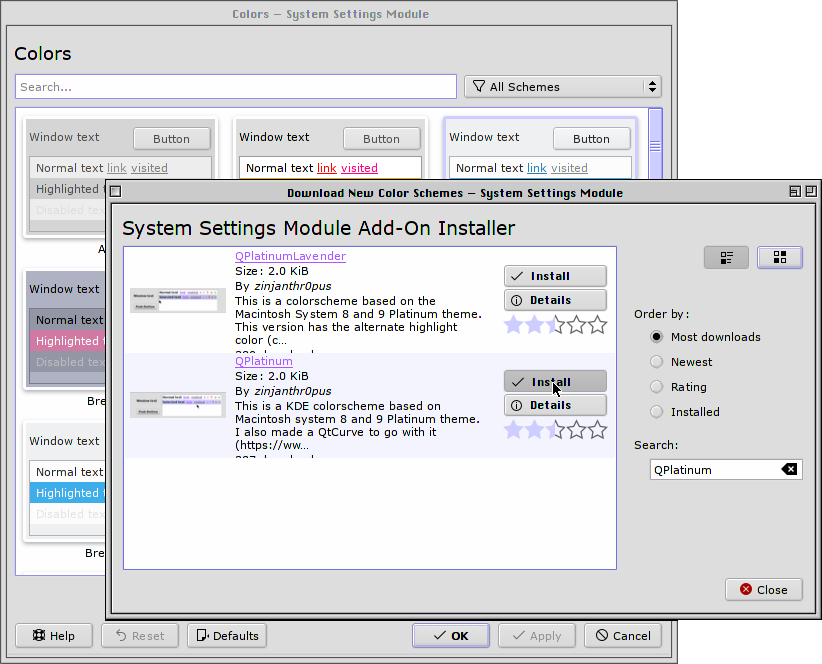
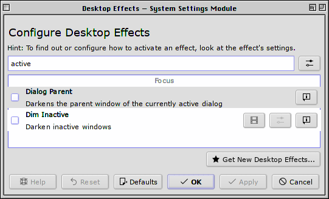

# kde-aurorae-platinum

Retro platinum-inspired theme for [KWin](https://en.wikipedia.org/wiki/KWin)'s _aurorae_ theme engine, unfortunately without the stripes as this isn't technically possible, but otherwise a close resemblance:


### Installation
1. `System Settings`> `Application Style`> `Window Decorations`
2. `Get New Window Decorations...`
3. Search "`Platinum`" and hit `Install`, or get it manually [here](https://store.kde.org/p/1319936/).
4. Set `Window border size` to `Normal`.
5. Reorder the titlebar buttons like this:
   
6. In case the decoration looks ugly, try flushing caches:
   
   ```
   rm -rf ~/.cache/plasm* ~/.cache/ico* && kwin_x11 --replace&
   ```

---

If you want to go fully _classic_, here's some extra tips:

1. Install the `qtcurve` widget style on your system and import the [QPlatinum preset](https://store.kde.org/p/1287743/):


2. Use the [QPlatinum](https://store.kde.org/p/1287747/) color scheme:


3. Disable inactive window dimming:


4. Install this [absolutely awesome Plymouth theme](https://store.kde.org/p/1284643/)
